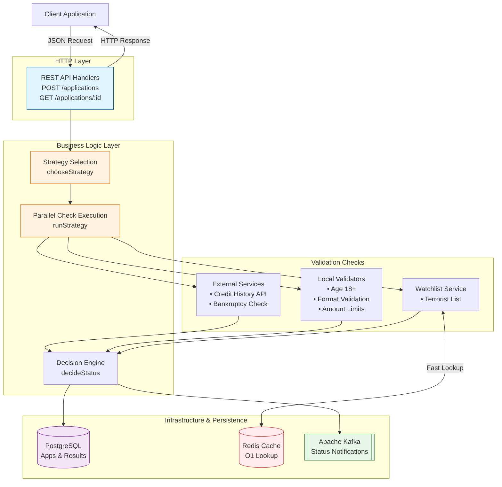

# 🏦 Credit Risk Assessment MVP

<div align="center">


**A high-performance scoring engine for automated credit risk evaluation.**  
Built with a focus on concurrency, resilience, and clean engineering patterns.

</div>

---

## 🏗️ System Architecture


```mermaid
graph TB
    Client[Client Application]
    
    subgraph "HTTP Layer"
        API[REST API Handlers<br/>POST /applications<br/>GET /applications/:id]
    end
    
    subgraph "Business Logic Layer"
        Strategy[Strategy Selection<br/>chooseStrategy]
        Runner[Parallel Check Execution<br/>runStrategy]
        Decision[Decision Engine<br/>decideStatus]
    end
    
    subgraph "Validation Checks"
        Local[Local Validators<br/>• Age 18+<br/>• Format Validation<br/>• Amount Limits]
        External[External Services<br/>• Credit History API<br/>• Bankruptcy Check]
        Watchlist[Watchlist Service<br/>• Terrorist List]
    end
    
    subgraph "Infrastructure & Persistence"
        DB[(PostgreSQL<br/>Apps & Results)]
        Redis[(Redis Cache<br/>O1 Lookup)]
        Kafka[[Apache Kafka<br/>Status Notifications]]
    end
    
    Client -->|JSON Request| API
    API --> Strategy
    Strategy --> Runner
    Runner --> Local
    Runner --> External
    Runner --> Watchlist
    
    Watchlist <-->|Fast Lookup| Redis
    External --> Decision
    Local --> Decision
    Watchlist --> Decision
    
    Decision --> DB
    Decision --> Kafka
    API -->|HTTP Response| Client
    
    style API fill:#e1f5ff,stroke:#01579b
    style Strategy fill:#fff3e0,stroke:#ef6c00
    style Runner fill:#fff3e0,stroke:#ef6c00
    style DB fill:#f3e5f5,stroke:#7b1fa2
    style Kafka fill:#e8f5e9,stroke:#2e7d32
    style Redis fill:#ffebee,stroke:#c62828
```

---


---

## 🔄 Request Flow

1. **POST /applications** — Client submits loan application data
2. **Parse & Validate** — Strict JSON validation and data extraction
3. **Choose Strategy** — Selection of the validation suite based on customer profile
4. **Run Strategy** — Execution of multiple checks (Local & External) in parallel
5. **Decide Status** — Final decision making based on check results
6. **Save Application** — Transactional persistence to PostgreSQL
7. **Notify** — Asynchronous event publishing to the Kafka topic
8. **Response** — Final decision returned to the client with detailed reports

---

## 🎯 Validation & Decision Logic

### Decision Matrix

| Result | Condition |
|--------|-----------|
| **Approved** ✅ | All mandatory validation checks passed |
| **Rejected** ❌ | At least one mandatory check failed (e.g., age < 18 or bankrupt) |
| **Manual Review** ⚠️ | Critical external service timeout or unavailability (e.g., Terrorist API down) |

### Strategies by Profile

| Customer Type | First Time | Primary Checks Applied |
|---------------|------------|------------------------|
| **Resident** | ✅ Yes | Age, Phone, Passport, Amount, Terrorist, Credit History |
| **Resident** | ❌ No | Age, Phone, Passport, Amount |
| **Non-Resident** | ✅ Yes | Age, Phone, Passport, Amount, Mandatory Terrorist Check |

---

## 📦 Installation & Setup

### 1. Start Infrastructure

Requires Docker and Docker Compose:

```bash
docker-compose up -d
```

### 2. Configuration

The application is configured via environment variables. Create a `.env` file:

```env
PORT=8080
DATABASE_URL=host=localhost port=5432 user=app password=app dbname=creditrisk sslmode=disable
REDIS_URL=localhost:6379
KAFKA_BROKERS=localhost:9092
KAFKA_TOPIC=application_topic
USE_REDIS=true
```

### 3. Run Application

```bash
make run
```

---

## 🧪 Quality Assurance
- **Linter**: `golangci-lint` (standard production settings)
- **Unit Testing**: Comprehensive tests for handlers and validation logic

```bash
make test
```

- **Graceful Shutdown**: Orchestrated termination that flushes Kafka buffers and waits for active HTTP requests before exiting

---

## 📡 API Usage Example

### Submit an Application

```bash
curl -X POST http://localhost:8080/applications \
  -H "Content-Type: application/json" \
  -d '{
    "name": "Ivanov Ivan Ivanovich",
    "birthdate": "1995-01-01",
    "phone": "+79991234567",
    "passport": "1234 567890",
    "residency": "resident",
    "first_time": true,
    "requested_amount": 50000
  }'
```

### Response Example

```json
{
  "application_id": "550e8400-e29b-41d4-a716-446655440000",
  "status": "approved",
  "strategy": "resident_first_time",
  "checks": [
    {
      "check": "age>=18",
      "status": "passed",
      "reason": ""
    },
    {
      "check": "valid_phone",
      "status": "passed",
      "reason": ""
    },
    {
      "check": "terrorist",
      "status": "passed",
      "reason": ""
    }
  ]
}
```

### Get Application by ID

```bash
curl http://localhost:8080/applications/550e8400-e29b-41d4-a716-446655440000
```

---

## 🛠️ Technology Stack

| Component | Technology |
|-----------|-----------|
| **Language** | Go 1.21+ |
| **HTTP Server** | net/http (stdlib) |
| **Database** | PostgreSQL 16 + pgx driver |
| **Cache** | Redis 7+ |
| **Message Queue** | Apache Kafka (KRaft mode) |
| **Concurrency** | golang.org/x/sync/errgroup |
| **Testing** | Go testing + testify |

---

## 📊 Database Schema

### Tables

- `application_statuses` — Enumeration of valid application statuses
- `check_statuses` — Enumeration of valid check statuses
- `applications` — Loan application records with JSONB payload
- `check_results` — Individual validation check results

### Indexes

- `idx_applications_status` — Fast filtering by application status
- `idx_check_results_application_id` — Efficient joins for retrieving all checks

---

## 🔐 Security & Best Practices

- ✅ **Prepared Statements** — SQL injection prevention
- ✅ **Input Validation** — Strict format checks for all fields
- ✅ **Timeout Controls** — All external HTTP calls have timeouts
- ✅ **Transaction Isolation** — ACID guarantees for data consistency
- ✅ **CHECK Constraints** — Database-level validation for critical fields

---

## 📈 Performance Optimizations

- **Parallel Check Execution** — Validation checks run concurrently using errgroup
- **Connection Pooling** — PostgreSQL connection pool for efficient database access
- **Redis Caching** — Terrorist watchlist cached with atomic updates
- **HTTP Client Timeouts** — Prevents hanging requests to external services

---

## 🚀 Future Improvements

- [ ] Add distributed tracing (OpenTelemetry)
- [ ] Implement circuit breaker for external services
- [ ] Add Prometheus metrics
- [ ] Implement rate limiting
- [ ] Add API authentication & authorization
- [ ] Structured logging (zerolog/zap)

---

## 📝 License

This project is licensed under the MIT License.

---

<div align="center">

**Developed by [cassame](https://github.com/cassame)**

*Professional Credit Risk Assessment MVP*

⭐ Star this repository if you find it helpful!

</div>